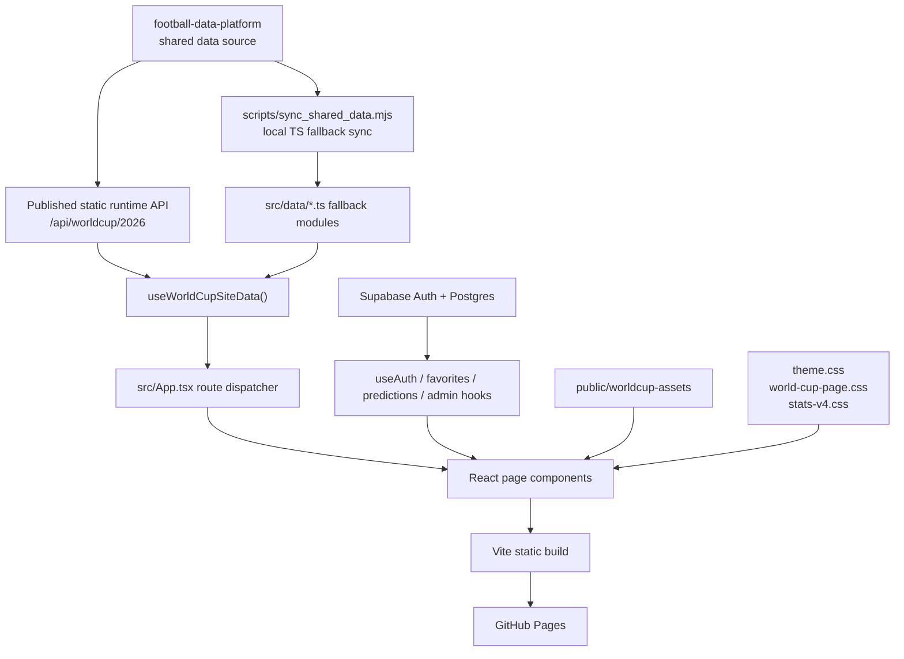
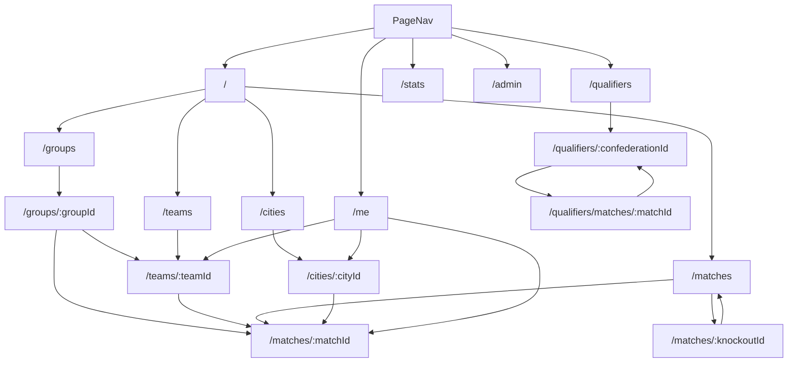

# World Cup 2026 Site Design

## 1. Project Context

### Product

This project is a 2026 FIFA World Cup editorial and data website. It combines:

- Tournament homepage
- Finals schedule, groups, teams, cities, and match detail pages
- Qualifier overview, confederation pages, and qualifier match detail pages
- Finals-only statistics dashboard
- User center for login, favorites, followed teams, and predictions
- Admin backend for user, permission, and activity management

The project is a frontend presentation site. It should not become the source of truth for football data. Shared football data belongs in:

```text
/Users/chamcham/Documents/AI/CODEX/soccer/football-data-platform
```

### Audience

- Chinese-speaking football fans
- Users who want to browse World Cup fixtures, groups, teams, host cities, and statistics
- Logged-in users who want to save favorites, follow teams, and submit match predictions
- Admin users who need basic account, permission, and activity management

### Core Goal

Make the site feel like a publishable tournament product, not a prototype, generic dashboard, or temporary data demo.

## 2. Scope And Non-Goals

### In Scope

- Display 2026 World Cup finals structure, schedule, groups, teams, cities, and match detail pages.
- Display World Cup qualifier data by confederation and match.
- Display finals-only statistical analysis.
- Load shared runtime data from `football-data-platform`.
- Fallback to local TypeScript data modules when runtime data cannot be loaded.
- Support Chinese as the primary interface and English via `/en` route prefix.
- Support user login through Supabase.
- Support favorites for teams, matches, and cities.
- Support user predictions for finals matches.
- Support admin reads/writes for profiles, roles, page permissions, user-page permissions, favorites, and predictions.
- Deploy as a static GitHub Pages site.

### Out Of Scope

- Owning raw football data scraping, provider-specific normalization, or canonical schema evolution.
- Running a backend server for the website.
- Directly creating Supabase Auth users from the frontend admin page.
- Paid data-provider ingestion inside this repository.
- Real-time live match tracking unless the shared data platform provides updated runtime data.
- Complex betting, odds, xG, tracking, or player-rating calculations in the frontend.

## 3. Current High-Level Architecture



## 4. Runtime Model

The site is a Vite React SPA. It does not use React Router. Route handling is centralized in:

```text
src/App.tsx
```

`App.tsx` reads `window.location.pathname`, normalizes locale prefixes, and manually selects the correct page component.

### Runtime Data Priority

The frontend uses this priority:

1. Runtime static JSON API from `football-data-platform`
2. Local TypeScript fallback modules in `src/data/*.ts`

Runtime load is handled by:

```text
src/hooks/useWorldCupSiteData.ts
src/data/siteData.ts
```

At startup:

1. `useWorldCupSiteData()` initializes with `fallbackWorldCupSiteData`.
2. It fetches runtime `manifest.json`.
3. It reads `runtime_contract.preferred_site_url` or `preferred_site_entrypoint`.
4. It fetches `site/bundle.json`.
5. It converts runtime JSON into `WorldCupSiteData`.
6. If runtime fetch fails, the page continues using fallback data and exposes the error on the root element as `data-data-warning`.

## 5. Data Sources And Contracts

### Primary Runtime API

Production default:

```text
https://waterdiu.github.io/football-data-platform/api/worldcup/2026
```

Development default:

```text
/api/worldcup/2026
```

The local Vite dev server maps `/api` to:

```text
/Users/chamcham/Documents/AI/CODEX/soccer/football-data-platform/data/public/api
```

This is implemented in:

```text
vite.config.ts
```

### Runtime Entry Points

Expected runtime files:

```text
manifest.json
site/bundle.json
core/bundle.json
```

The 2026 site currently consumes the page-compatible `site/bundle.json`, not the lower-level `core/bundle.json`.

### Runtime Site Bundle Shape

`src/data/siteData.ts` expects:

```ts
type RuntimeSiteBundle = {
  generated_at?: string;
  datasets?: {
    groups?: GroupCardData[];
    group_fixtures?: GroupFixtureData[];
    group_stage_matches?: GroupStageMatchData[];
    bracket?: BracketRoundData[];
    full_schedule?: FullScheduleMatchData[];
    finals_results?: FinalsMatchResultData[];
    finals_coverage?: FinalsDataCoverageData;
    qualifier_matches?: QualifierMatchData[];
    qualifier_missing_data?: QualifierMissingDataReport;
    qualifier_source_reports?: QualifierSourceReport[];
  };
};
```

Missing required runtime datasets cause runtime loading to fail and the frontend falls back to local TypeScript data.

### Local Fallback Data

Fallback modules are imported by `src/data/siteData.ts`:

```text
src/data/groups.ts
src/data/groupFixtures.ts
src/data/groupStageMatches.ts
src/data/bracket.ts
src/data/fullSchedule.ts
src/data/finalsMatchResults.ts
src/data/finalsDataCoverage.ts
src/data/qualifierMatches.ts
```

These files should be treated as fallback/generated data, not long-term manual truth.

### Shared Data Sync

The script:

```text
scripts/sync_shared_data.mjs
```

By default it reads from a sibling `football-data-platform/data/public` directory. CI or non-standard local layouts can override the platform location with:

```text
FOOTBALL_DATA_PLATFORM_DIR=/absolute/path/to/football-data-platform
```

The sync script reads these data files:

```text
worldcup-site-groups.json
worldcup-site-group-fixtures.json
worldcup-site-group-stage-matches.json
worldcup-site-bracket.json
worldcup-site-full-schedule.json
worldcup-site-finals-results.json
worldcup-site-finals-coverage.json
worldcup-site-qualifier-matches.json
```

and writes the fallback TypeScript modules above.

`package.json` runs this script in both `pretest` and `prebuild`:

```bash
npm test
npm run build
```

This means tests and builds refresh local fallback data first, preventing stale TypeScript compatibility data from being published. GitHub Actions checks out `waterdiu/football-data-platform` and points `FOOTBALL_DATA_PLATFORM_DIR` at that checkout. User-facing data freshness is still primarily controlled by the published `football-data-platform` API; local fallback data is used when the runtime API is unavailable.

## 6. Core Domain Entities

The main TypeScript contracts live in:

```text
src/types/tournament.ts
```

### Tournament Metadata

`TournamentMeta` stores high-level finals metadata:

- name
- year
- hosts
- host city names
- start/final dates
- team/group/match counts
- opening match label
- draw date label

### Groups

`GroupCardData`:

- group id
- draw status
- draw note
- teams

`GroupTeamData`:

- team name
- played/won/drawn/lost
- goals for/against
- points

### Fixtures

`GroupFixtureData`:

- match id
- group id
- round/date/venue
- home/away teams
- optional score
- prediction display fields

`GroupStageMatchData` extends group fixture with:

- matchday label

`FullScheduleMatchData`:

- full 104-match schedule row
- Beijing time label
- city
- venue
- title

### Knockout Bracket

`BracketRoundData`:

- round label
- bracket matches

`BracketMatchData`:

- id
- date
- home/away placeholders
- venue
- prediction status

### Finals Results And Statistics

`FinalsMatchResultData`:

- match id
- group or knockout stage type
- status
- score fields
- extra-time / penalty flags
- goal events
- source and update label

`FinalsDataCoverageData`:

- coverage timestamp
- score coverage percent
- goal-event coverage percent
- issue count

### Qualifier Matches

`QualifierMatchData`:

- confederation
- stage
- date
- teams and score
- optional venue
- optional stats
- optional events
- optional lineups
- optional player ratings
- missing-data list

Qualifier data is intentionally tolerant of missing fields because free and partial sources often do not provide full stats, lineups, substitutions, cards, or player ratings.

## 7. Routing And Page Relationship

Routes are manually resolved in `src/App.tsx`.



### Current Page Components

| Route | Component | Purpose |
|---|---|---|
| `/` | `HomePage` | Main landing page, hero, KPIs, groups, schedule, cities, teams |
| `/groups` | `GroupsPage` | Group list and standings shell |
| `/groups/:groupId` | `GroupDetailPage` | One group, teams, group fixtures |
| `/teams` | `TeamsPage` | 48-team overview |
| `/teams/:teamId` | `TeamDetailPage` | Team profile, fixtures, squad/history content |
| `/matches` | `MatchesPage` | Group fixtures and knockout bracket |
| `/matches/:matchId` | `MatchDetailPage` | Group or knockout match detail |
| `/cities` | `CitiesPage` | Host city map and city list |
| `/cities/:cityId` | `CityDetailPage` | City/stadium detail and hosted matches |
| `/qualifiers` | `QualifiersOverviewPage` | Qualifier dashboard by confederation |
| `/qualifiers/:confederationId` | `QualifierConfederationPage` | Confederation detail, qualified teams, match list |
| `/qualifiers/matches/:matchId` | `QualifierMatchDetailPage` | Qualifier match stats/events/missing data |
| `/stats` | `StatsPageV4` | Finals-only stats dashboard |
| `/me` | `UserCenterPage` | Auth, profile, favorites, followed teams, predictions |
| `/admin` | `AdminPage` | Admin dashboard, users, records, permissions |

### Locale Routing

Locale support is implemented in:

```text
src/i18n/content.ts
```

Rules:

- Chinese is the default route namespace.
- English routes use `/en`.
- `/zh` is normalized back to the default Chinese route.
- `localizePath()` prefixes links when locale is English.
- `stripAppBasePath()` supports GitHub Pages base path.

### Return Navigation Rules

Every non-home page must expose a clear return path:

- Top-level list or feature pages use the `page-return-bar` in `App.tsx` to return home, including groups, teams, matches, cities, qualifiers, stats, user center, and admin.
- Detail pages provide an in-page return button to their parent list, such as team detail back to teams, match detail back to matches, city detail back to cities, and qualifier match detail back to the relevant confederation page.
- New pages must define their parent route before implementation; do not rely only on the browser back button or top brand link.

## 8. Page Responsibilities

### Home Page

`HomePage` is the product entry.

Responsibilities:

- Show rotating hero slides.
- Link promo poster/video and opening match.
- Show four KPI cards: teams, matches, cities, groups.
- Show group cards with standings columns.
- Show schedule controls and fixtures.
- Show city cards with city posters.
- Show team grid.

Data:

- `getHomepageHeroSlides()`
- `fullSchedule`
- `groups`
- `groupFixtures`
- `tournamentMeta`

### Finals Pages

Finals pages include:

- groups
- teams
- matches
- cities
- match detail

They should share the `.world-cup-page--finals` visual system.

Team detail page rules:

- The basic information area does not render a standalone title or explanatory paragraph. It renders five connected fact boxes with the same total width as the detail content below.
- The coach/player area does not render a "squad list" subtitle or descriptive copy. It shows the personnel rows directly.
- Personnel rows use compact table density. Status chips are limited to the standard states: `confirmed/appointed`, `candidate/provisional`, `pending`, `injured`, `suspended`, and `omitted`.
- Team pages prefer the `football-data-platform` runtime core contract `core/rosters.json`. When a team has an official FIFA 26-player roster, the personnel section renders that real roster; uncovered teams fall back to local editorial profiles or a final-squad-pending placeholder.
- World Cup history headings use a "World Cup (year)" pattern and must not repeat the year as a secondary small line.
- Expanded history rows keep compact typography and row height. Date, location, and stadium fields are shown only when the data source provides them; the UI must not fabricate them.
- Qualification and recent-match rows should link to match detail only when an internal match id exists. If the data is outside the current site contract, show it only as a result summary.
- Team detail pages must not use legacy blue backgrounds or blue gradient panels. History, qualification, recent form, fixtures, and personnel lists must use the current hard-edge dark editorial styling.

Matches overview page rules:

- The page only keeps required titles such as "Schedule Overview", "Group Stage", and "Knockout Stage"; explanatory description copy is not shown.
- Phase metric boxes show match counts only and must not look clickable or hover-interactive.
- The group-stage list has a fixed internal scroll area and initializes to the nearest upcoming match by current date.
- The knockout bracket width must stay within the standard content width and not exceed the group-stage or metric sections.
- The matches overview page does not use decorative background imagery or legacy blue gradient panels.

### Qualifier Pages

Qualifier pages include:

- overview map/dashboard
- confederation detail
- qualifier match detail

They use `qualifierMatches`, `confederations`, and source/missing-data reports. These pages must expose missing-data status clearly because qualifier data coverage is uneven.

### Statistics Page

`StatsPageV4` is finals-only.

It must not include city/stadium/travel content. It should focus on:

- match counts
- goals
- score distribution
- team attack/defense
- phase comparison
- goal timing when data exists
- coverage status

Current page can use simulated or placeholder finals results before 2026 matches complete, but the data source and coverage state must be clear.

### User Center

`UserCenterPage` handles:

- Supabase login
- Google login
- email/password login
- email signup
- profile display/update
- favorites
- followed teams
- predictions
- leaderboard-style user summary UI

Favorites can target:

- `team`
- `match`
- `city`

Predictions target finals match ids.

### Admin Page

`AdminPage` handles:

- admin login gate
- user profile table
- role management
- page permission management
- user-page permission management
- favorites and prediction records
- summary statistics

The frontend cannot directly create real Supabase Auth users. Creating users requires Supabase Auth admin APIs, an Edge Function, or another trusted backend.

## 9. User And Permission Architecture

### Supabase Client

Client setup:

```text
src/lib/supabase.ts
```

Required environment variables:

```text
VITE_SUPABASE_URL
VITE_SUPABASE_ANON_KEY
```

The frontend uses Supabase public anon key with Row Level Security.

### Auth Hook

`src/hooks/useAuth.ts` provides:

- current user
- loading state
- auth message
- Google OAuth
- email/password sign-in
- email signup
- sign-out

OAuth redirect URL is generated from current path and Vite base path so GitHub Pages subpath deployments keep users on the expected page.

### Database Tables

Schema baseline:

```text
docs/supabase-user-schema.sql
```

Tables:

| Table | Purpose |
|---|---|
| `profiles` | User profile, email, display name, avatar, status |
| `favorites` | User favorites for teams, matches, cities |
| `predictions` | User match predictions |
| `user_roles` | Admin role assignment |
| `page_permissions` | Page-level permission configuration |
| `user_page_permissions` | User-specific page overrides |
| `user_activity_events` | Optional user/admin activity logging |

### Security Model

- RLS must remain enabled.
- Users can read/write their own favorites and predictions.
- Users can read/update their own profile.
- Admins can read broader profile/favorites/prediction/permission data.
- Admin detection uses `user_roles.role = 'admin'`.
- `useAdminStatus()` caches admin status in `localStorage` only as a UI optimization. Real access control must still rely on Supabase RLS.

### Page Permissions

The current schema supports page permissions, but route enforcement is not yet a full frontend guard for every route. Treat `page_permissions` and `user_page_permissions` as management data until explicit route guards are implemented.

Default page permissions inserted by SQL:

- public: `/`, `/qualifiers`, `/stats`, `/groups`, `/matches`, `/teams`, `/cities`
- logged-in: `/me`
- admin-only: `/admin`

## 10. Assets And Media

Assets live under:

```text
public/worldcup-assets
```

Important asset groups:

| Path | Purpose |
|---|---|
| `2026worldcup.jpg` | homepage promo poster source |
| `2026worldcup.mp4` | homepage promo video |
| `optimized/` | optimized homepage and opening-match images |
| `matchpost/` | manually generated match posters |
| `cities/` | city card images |
| `cities-normalized/` | normalized city images |
| `stadiums/` | stadium external photos |
| `maps/` | map reference assets |
| `cities-map-stage.png` | rendered North America host city map |
| `home/daily-hero.json` | generated daily hero metadata |

### Daily Hero Workflow

Documented in:

```text
docs/daily-home-hero.md
```

Manual generated posters are placed in:

```text
public/worldcup-assets/home/manual/
```

Then run:

```bash
npm run generate:daily-hero -- --date 2026-06-12
```

The script chooses the next day's spotlight match, writes optimized outputs, and updates:

```text
public/worldcup-assets/home/daily-hero.json
src/data/dailyHero.json
```

## 11. Visual System

### Style Prompt

2026 host-nations tournament poster on a dark stage: deep midnight field, saturated Canada red / Mexico green / USA navy shards, paper-cut geometry, sweeping motion ribbons, and monumental event typography.

### Visual Direction

- Mood: celebratory, sharp, graphic, official, high-energy, night-stage.
- Keywords: paper-cut, host nation tricolor, stadium icon, motion ribbon, confetti shard, giant scoreboard type.
- Memorable element: dark stage canvas with red/green/blue fragments and data panels like official tournament boards.
- Avoid: generic dark corporate dashboards, glassmorphism, purple SaaS gradients, muted corporate colors, soft rounded-card systems.

### CSS Files

```text
src/styles/theme.css
src/styles/world-cup-page.css
src/styles/stats-v4.css
src/styles/global.css
```

`world-cup-page.css` is the primary site-level visual system. It includes a site-wide UI consistency guardrail near the bottom of the file.

### Page Theme Classes

`App.tsx` assigns these classes:

- `world-cup-page--finals` for homepage and finals-linked pages
- `world-cup-page--qualifiers` for qualifier pages
- `world-cup-page--stats` for stats page

### Typography And Scale

Current linked-page consistency variables:

```css
--site-title-size
--site-section-title-size
--site-card-title-size
--site-body-size
--site-meta-size
--site-line-height
```

Rules:

- Page titles use the shared title scale.
- Section titles use the shared section scale.
- Card and row titles use the shared card title scale.
- Metadata uses mono type.
- Child pages must not drift into oversized headings.

### Shape Language

The current design direction is hard-edged editorial data-board style.

Rules:

- Avoid rounded SaaS cards.
- Prefer 1px borders and hard-edged panels.
- Use restrained shadow.
- Use green accent consistently for primary data highlights.
- User/admin pages may use dense panels, but must stay visually connected to stats/finals pages.
- Team detail, match detail, city detail, qualifier detail, and other child pages follow the same hard-edge rule. Rows, personnel tables, history records, recent form items, permission controls, and metric items must not reintroduce rounded-card styling even when their class names do not include `card` or `panel`.

## 12. Build, Test, And Deployment

### Local Development

Default port:

```text
5174
```

Run:

```bash
npm install
npm run dev
```

The Vite server uses `strictPort: true` to avoid conflicts with other local projects.

### Tests

Run:

```bash
npm test
```

Current test coverage includes:

- route rendering
- data integrity
- finals fetch behavior
- layout tests

### Build

Run:

```bash
npm run build
```

Build output:

```text
dist/
dist/index.html
dist/404.html
```

`404.html` is copied from `index.html` for GitHub Pages SPA fallback.

### GitHub Pages Deployment

Workflow:

```text
.github/workflows/deploy-pages.yml
```

Triggers:

- push to `main`
- manual `workflow_dispatch`
- scheduled every 30 minutes

Build environment:

```text
VITE_GITHUB_PAGES=true
VITE_WORLDCUP_DATA_API_BASE
VITE_SUPABASE_URL
VITE_SUPABASE_ANON_KEY
```

The scheduled deployment does not itself update `football-data-platform`; it rebuilds/redeploys this site. Runtime JSON freshness depends on the data platform deployment.

## 13. External Dependencies

### Runtime Dependencies

| Package | Purpose |
|---|---|
| `react` | UI |
| `react-dom` | UI rendering |
| `@supabase/supabase-js` | Auth and database access |
| `chart.js` | Chart rendering |

### Dev Dependencies

| Package | Purpose |
|---|---|
| `vite` | dev/build server |
| `typescript` | static typing |
| `vitest` | tests |
| `@testing-library/react` | component tests |
| `jsdom` | test DOM |
| `@vitejs/plugin-react` | Vite React support |

### External Services

| Service | Purpose |
|---|---|
| GitHub Pages | static hosting |
| GitHub Actions | deploy workflow |
| Supabase | auth, user data, admin data |
| football-data-platform GitHub Pages | runtime football data API |

## 14. Extension Strategy

### Adding A New Page

1. Add the component in `src/pages`.
2. Add route handling in `src/App.tsx`.
3. Add navigation links only if it is a top-level page.
4. Add data contracts in `src/types/tournament.ts` if the page requires new structured data.
5. If data is shared/canonical, add it first in `football-data-platform`, then consume it here.
6. Add tests in `src/test/App.test.tsx` or a focused test file.
7. Update this `DESIGN.md`.

### Adding New Shared Data

Preferred path:

1. Define source and schema in `football-data-platform`.
2. Publish into its runtime API.
3. Add TypeScript contract in this project only as a consumer shape.
4. Update `src/data/siteData.ts` loader if the runtime bundle adds a new dataset.
5. Optionally update `scripts/sync_shared_data.mjs` for fallback generation.
6. Add fallback data only as generated compatibility, not as the canonical source.

### Adding New User Features

1. Update Supabase SQL schema and RLS policies.
2. Add or update hooks under `src/hooks`.
3. Keep frontend writes scoped to current user unless admin-only.
4. Update admin views if admins need visibility.
5. Update docs and tests.

### Adding New Visual Patterns

1. Reuse the current editorial data-board language.
2. Add tokens or shared rules in `world-cup-page.css`.
3. Avoid page-only styling that breaks global typography and card scale.
4. Use Playwright/browser checks for representative pages and child pages.

## 15. Key Constraints And Risks

### Data Freshness

Runtime freshness depends on `football-data-platform` publishing current JSON. The site now runs `sync:shared-data` before tests and builds so published bundles do not contain stale TypeScript fallback data. This sync protects fallback compatibility, while normal user visits still prefer the runtime API.

### Static Hosting

The site is static. Anything requiring privileged backend access cannot be safely implemented directly in this repository.

### Supabase Admin Limits

Frontend admin pages can manage rows allowed by RLS, but cannot securely create Supabase Auth users without a backend or Edge Function.

### Route Enforcement

Page permission data exists, but full route-level enforcement should be explicitly implemented before treating it as access control.

### Bundle Size

The current Vite build warns about large chunks. Future work should consider route-level code splitting if load performance becomes a problem.

### Visual Drift

The site has many pages and historical CSS. New work must verify linked child pages, not only the homepage.

## 16. Project Rules And Coordination Boundary

Project execution rules are recorded in:

```text
AGENTS.md
docs/2026-05-17-project-rules.md
```

The active Codex work boundary is:

```text
/Users/chamcham/Documents/AI/CODEX/soccer/worldcup/2026
```

The site conversation may read, but must not edit, these coordination documents:

```text
/Users/chamcham/Documents/AI/CODEX/soccer/football-data-platform/docs/2026-05-17-coordination-and-github-publish-rules.md
/Users/chamcham/Documents/AI/CODEX/soccer/WORKSPACE_STATUS.md
```

If the site needs data-layer or model-layer changes, it should produce a handoff note for the user to forward to the appropriate project conversation. This project only owns the presentation site UI, routing, frontend data consumption, fallback behavior, Supabase frontend integration, tests, deployment, and site documentation.

GitHub publishing policy: prefer normal SSH Git `fetch/pull/push`; if full fetch is slow because it downloads historical blobs, use `git fetch --filter=blob:none --no-tags origin main` to align commit history first; use GitHub API only when SSH/Git transport fails. Always check `git status --short --branch` before publishing.

## 17. Verification Checklist

Before completing meaningful changes:

- Run `npm test`.
- Run `npm run build`.
- Browser-check representative routes:
  - `/`
  - `/groups`
  - `/groups/A`
  - `/teams`
  - `/teams/Mexico`
  - `/matches`
  - `/matches/1`
  - `/matches/73`
  - `/cities`
  - `/cities/Dallas`
  - `/qualifiers`
  - `/qualifiers/afc`
  - `/qualifiers/matches/<id>`
  - `/stats`
  - `/me`
  - `/admin`
- Check no unintended horizontal overflow.
- Check page title, section title, and card title scale.
- Check rounded-card regressions.
- Check Supabase-authenticated states when changing user/admin pages.
- Check runtime data fallback behavior when changing data loading.

## 18. Documentation Maintenance Rules

This file is the main design baseline for the `worldcup/2026` project.

Update this file when changing:

- page architecture
- route structure
- data source or runtime API contract
- local fallback data strategy
- Supabase schema or RLS assumptions
- user/admin feature boundaries
- deployment or port behavior
- visual system rules
- external dependencies

Small implementation-only changes can leave this file unchanged, but the final delivery note must say why the design baseline was not affected.
