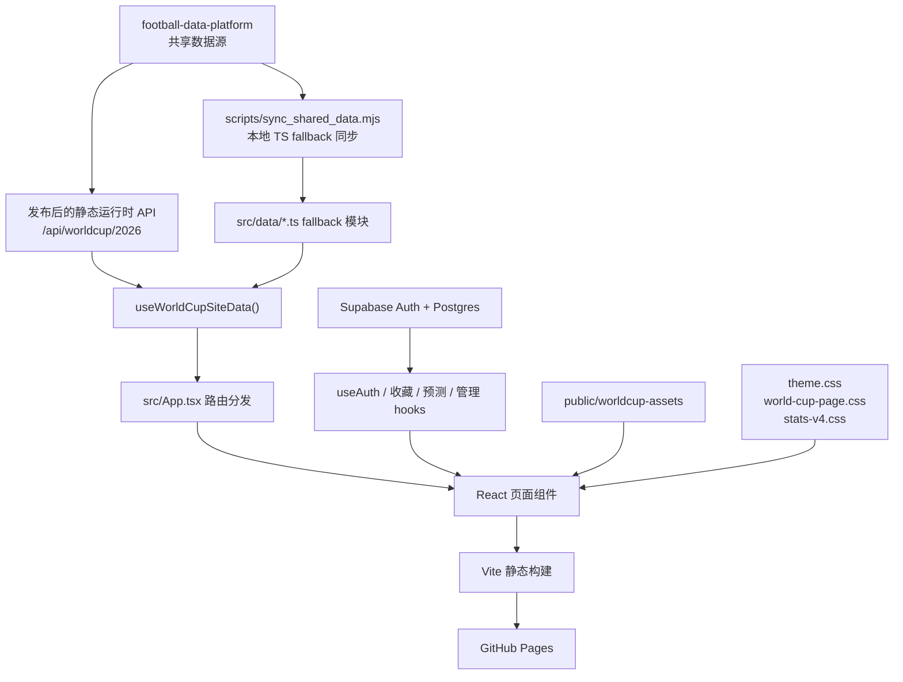
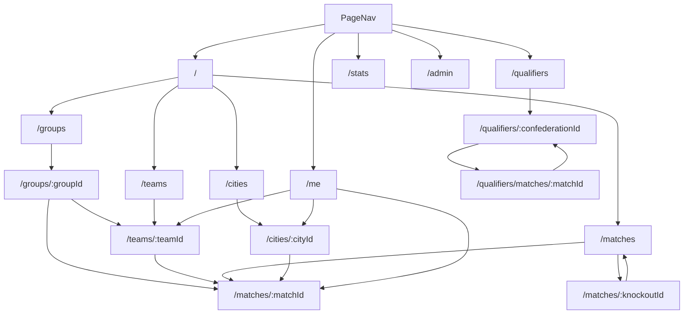

# 2026 世界杯网站设计文档

## 1. 项目背景

### 产品定位

本项目是一个 2026 FIFA 世界杯专题展示与数据网站，当前包含：

- 世界杯首页
- 正赛赛程、小组、球队、城市、比赛详情页面
- 预选赛总览、洲别详情、预选赛比赛详情页面
- 只统计世界杯正赛的数据统计页面
- 用户中心，包括登录、收藏、关注球队、比赛预测
- 管理后台，包括用户、权限、记录和数据统计管理

本项目定位是前端展示站，不应该成为足球数据的事实源。足球数据的共享维护项目是：

```text
/Users/chamcham/Documents/AI/CODEX/soccer/football-data-platform
```

### 目标用户

- 中文足球用户
- 希望浏览世界杯赛程、小组、球队、主办城市和统计数据的用户
- 登录后希望收藏比赛、关注球队、提交预测的用户
- 需要管理账号、权限、收藏和预测记录的管理员

### 核心目标

让网站像一个可以正式发布的世界杯产品，而不是临时原型、通用后台或数据实验页面。

## 2. 范围与非目标

### 项目范围

- 展示 2026 世界杯正赛结构、赛程、小组、球队、城市和比赛详情。
- 按大洲和比赛展示世界杯预选赛数据。
- 展示只针对世界杯正赛的数据统计分析。
- 从 `football-data-platform` 加载共享运行时数据。
- 当运行时数据不可用时，回退到本项目内的 TypeScript 数据模块。
- 默认中文界面，并通过 `/en` 前缀支持英文页面。
- 通过 Supabase 支持用户登录。
- 支持收藏球队、比赛和城市。
- 支持用户提交正赛比赛预测。
- 支持管理员读取和修改用户资料、角色、页面权限、用户页面权限、收藏和预测。
- 作为静态站点部署到 GitHub Pages。

### 非目标

- 不在本项目内维护原始足球数据抓取、供应商数据标准化或核心 schema 演进。
- 不在本项目内运行后端服务。
- 不从前端管理后台直接创建 Supabase Auth 真实用户。
- 不在本项目内接入付费数据源采集逻辑。
- 除非共享数据平台提供更新后的运行时数据，否则不做实时比赛追踪。
- 不在前端实现复杂投注、赔率、xG、球员追踪或评分算法。

## 3. 当前总体架构



## 4. 运行模型

本项目是 Vite + React 单页应用。当前没有使用 React Router，路由逻辑集中在：

```text
src/App.tsx
```

`App.tsx` 读取 `window.location.pathname`，处理语言前缀，然后手动选择需要渲染的页面组件。

### 运行时数据优先级

前端当前的数据优先级是：

1. 来自 `football-data-platform` 的运行时静态 JSON API
2. 本项目 `src/data/*.ts` 里的本地 TypeScript fallback 数据

运行时数据加载由以下文件负责：

```text
src/hooks/useWorldCupSiteData.ts
src/data/siteData.ts
```

启动流程：

1. `useWorldCupSiteData()` 先使用 `fallbackWorldCupSiteData` 初始化页面。
2. 请求运行时 `manifest.json`。
3. 读取 `runtime_contract.preferred_site_url` 或 `preferred_site_entrypoint`。
4. 请求 `site/bundle.json`。
5. 将运行时 JSON 转成 `WorldCupSiteData`。
6. 如果运行时数据请求失败，页面继续使用本地 fallback 数据，并在根元素上通过 `data-data-warning` 暴露错误信息。

## 5. 数据源与数据契约

### 主运行时 API

生产环境默认地址：

```text
https://waterdiu.github.io/football-data-platform/api/worldcup/2026
```

开发环境默认地址：

```text
/api/worldcup/2026
```

本地 Vite 开发服务器会把 `/api` 映射到：

```text
/Users/chamcham/Documents/AI/CODEX/soccer/football-data-platform/data/public/api
```

这个开发代理逻辑在：

```text
vite.config.ts
```

### 运行时入口文件

预期运行时文件：

```text
manifest.json
site/bundle.json
core/bundle.json
```

当前 2026 展示站消费的是页面兼容层 `site/bundle.json`，不是更底层的 `core/bundle.json`。

### 数据源健康与覆盖状态

`football-data-platform` 已发布 source health v2，这是兼容增强。当前 2026 展示站不需要立刻修改 UI，因为原有 coverage 字段仍保持兼容。

新增可选运行时文件：

```text
source-health.json
../source-health.json
```

`core/data-coverage.json` 的每场比赛可以包含更丰富的字段：

```text
overall_confidence
overall_confidence_score
kelly_multiplier_cap
sources
blocking_flags
fallbacks_used
```

原有 `fixture`、`result`、`events`、`lineups`、`odds`、`injuries`、`weather`、`prediction` 等 coverage 字段仍属于兼容契约。后续如果管理后台或比赛详情页要展示“数据为什么缺失、数据源是否过期、是否使用 fallback、数据可信度”，应优先读取 `data-coverage.sources`、`blocking_flags`、`fallbacks_used` 和 `source-health.json`，不要在前端自行编造状态结论。

### 运行时 site bundle 结构

`src/data/siteData.ts` 期望的数据结构：

```ts
type RuntimeSiteBundle = {
  generated_at?: string;
  datasets?: {
    groups?: GroupCardData[];
    group_fixtures?: GroupFixtureData[];
    group_stage_matches?: GroupStageMatchData[];
    bracket?: BracketRoundData[];
    full_schedule?: FullScheduleMatchData[];
    finals_results?: FinalsMatchResultData[];
    finals_coverage?: FinalsDataCoverageData;
    qualifier_matches?: QualifierMatchData[];
    qualifier_missing_data?: QualifierMissingDataReport;
    qualifier_source_reports?: QualifierSourceReport[];
  };
};
```

如果运行时缺少必需数据集，运行时加载会失败，前端会回退到本地 TypeScript 数据。

### 本地 fallback 数据

`src/data/siteData.ts` 导入这些 fallback 模块：

```text
src/data/groups.ts
src/data/groupFixtures.ts
src/data/groupStageMatches.ts
src/data/bracket.ts
src/data/fullSchedule.ts
src/data/finalsMatchResults.ts
src/data/finalsDataCoverage.ts
src/data/qualifierMatches.ts
```

这些文件应该被视为 fallback 或生成数据，不应该作为长期人工维护的数据事实源。

### 共享数据同步脚本

同步脚本：

```text
scripts/sync_shared_data.mjs
```

默认从本项目同级目录的 `football-data-platform/data/public` 读取这些文件。CI 或其他目录结构可以通过环境变量指定数据层项目位置：

```text
FOOTBALL_DATA_PLATFORM_DIR=/absolute/path/to/football-data-platform
```

同步脚本读取的数据文件：

```text
worldcup-site-groups.json
worldcup-site-group-fixtures.json
worldcup-site-group-stage-matches.json
worldcup-site-bracket.json
worldcup-site-full-schedule.json
worldcup-site-finals-results.json
worldcup-site-finals-coverage.json
worldcup-site-qualifier-matches.json
```

然后写入上面列出的本地 TypeScript fallback 模块。

`package.json` 已将同步脚本挂到 `pretest` 和 `prebuild`：

```bash
npm test
npm run build
```

这意味着测试和构建都会先刷新本地 fallback 数据，避免发布旧的 TypeScript 兼容数据。GitHub Actions 会先 checkout `waterdiu/football-data-platform`，再通过 `FOOTBALL_DATA_PLATFORM_DIR` 指向该目录。用户实际访问时的数据及时性仍主要由已发布的 `football-data-platform` API 决定，本地 fallback 负责运行时 API 不可用时的兼容显示。

## 6. 核心领域实体

主要 TypeScript 数据契约在：

```text
src/types/tournament.ts
```

### 赛事元数据

`TournamentMeta` 存储世界杯正赛高层信息：

- 赛事名称
- 年份
- 主办国
- 主办城市名称
- 开赛日期和决赛日期
- 球队数、小组数、比赛数
- 揭幕战说明
- 抽签日期说明

### 小组

`GroupCardData`：

- 小组 id
- 抽签状态
- 抽签说明
- 球队列表

`GroupTeamData`：

- 球队名
- 已赛、胜、平、负
- 进球、失球
- 积分

### 比赛

`GroupFixtureData`：

- 比赛 id
- 小组 id
- 轮次、日期、场馆
- 主队、客队
- 可选比分
- 预测展示字段

`GroupStageMatchData` 在小组赛比赛基础上增加：

- 比赛日标签

`FullScheduleMatchData`：

- 104 场完整赛程记录
- 北京时间标签
- 城市
- 场馆
- 比赛标题

### 淘汰赛

`BracketRoundData`：

- 轮次名称
- 淘汰赛比赛列表

`BracketMatchData`：

- id
- 日期
- 主客队占位文案
- 场馆
- 预测状态

### 正赛结果与统计

`FinalsMatchResultData`：

- 比赛 id
- 小组赛或淘汰赛类型
- 比赛状态
- 比分字段
- 加时和点球标记
- 进球事件
- 来源和更新时间

`FinalsDataCoverageData`：

- 覆盖更新时间
- 比分覆盖率
- 进球事件覆盖率
- 问题数量

### 预选赛比赛

`QualifierMatchData`：

- 所属大洲
- 阶段
- 日期
- 双方球队和比分
- 可选场馆
- 可选比赛统计
- 可选事件
- 可选阵容
- 可选球员评分
- 缺失数据列表

预选赛数据设计上允许字段缺失，因为免费和半公开数据源通常无法稳定提供完整统计、阵容、换人、红黄牌和球员评分。

## 7. 路由与页面关系

路由在 `src/App.tsx` 中手动解析。



### 当前页面组件

| 路由 | 组件 | 作用 |
|---|---|---|
| `/` | `HomePage` | 首页、Hero、统计栏、小组、赛程、城市、球队 |
| `/groups` | `GroupsPage` | 小组列表和积分结构 |
| `/groups/:groupId` | `GroupDetailPage` | 单个小组、球队、该组比赛 |
| `/teams` | `TeamsPage` | 48 支球队总览 |
| `/teams/:teamId` | `TeamDetailPage` | 球队资料、赛程、阵容和历史内容 |
| `/matches` | `MatchesPage` | 小组赛程和淘汰赛图 |
| `/matches/:matchId` | `MatchDetailPage` | 小组赛或淘汰赛比赛详情 |
| `/cities` | `CitiesPage` | 主办城市地图和城市列表 |
| `/cities/:cityId` | `CityDetailPage` | 城市、球场和承办比赛 |
| `/qualifiers` | `QualifiersOverviewPage` | 按大洲展示预选赛总览 |
| `/qualifiers/:confederationId` | `QualifierConfederationPage` | 大洲详情、晋级球队、比赛列表 |
| `/qualifiers/matches/:matchId` | `QualifierMatchDetailPage` | 预选赛比赛统计、事件、缺失数据 |
| `/stats` | `StatsPageV4` | 世界杯正赛统计页面 |
| `/me` | `UserCenterPage` | 登录、资料、收藏、关注球队、预测 |
| `/admin` | `AdminPage` | 管理后台、用户、记录、权限 |

### 多语言路由

多语言逻辑在：

```text
src/i18n/content.ts
```

规则：

- 中文是默认路由空间。
- 英文路由使用 `/en`。
- `/zh` 会被规范化回默认中文路由。
- `localizePath()` 在英文环境下给链接加 `/en` 前缀。
- `stripAppBasePath()` 支持 GitHub Pages 子路径部署。

### 返回导航规则

除首页外，页面必须有清晰的返回路径：

- 顶级列表或功能页面通过 `App.tsx` 的 `page-return-bar` 返回首页，包括小组、球队、赛程、城市、预选赛、统计、我的世界杯和管理后台。
- 详情页面在页面内容内提供返回上级列表的按钮，例如球队详情返回球队总览、比赛详情返回赛程、城市详情返回城市总览、预选赛比赛详情返回对应大洲详情。
- 新增页面时必须先确定它的上级页面；不能只依赖浏览器后退或顶部品牌链接。

## 8. 页面职责

### 首页

`HomePage` 是产品入口。

职责：

- 展示轮播 Hero。
- 连接宣传海报/视频和揭幕战。
- 展示四个 KPI：球队、比赛、城市、小组。
- 展示带积分列的小组卡片。
- 展示赛程控制和比赛列表。
- 展示带城市图片的城市卡片。
- 展示球队网格。

数据：

- `getHomepageHeroSlides()`
- `fullSchedule`
- `groups`
- `groupFixtures`
- `tournamentMeta`

### 正赛相关页面

正赛页面包括：

- 小组
- 球队
- 比赛
- 城市
- 比赛详情

这些页面应共享 `.world-cup-page--finals` 视觉系统。

球队详情页的固定规则：

- 基本信息区不显示独立标题或说明文字，直接使用 5 个连在一起的事实框，总宽度必须与下方详情内容一致。
- 球队总览页桌面端使用 8 列 × 6 行紧凑网格，避免 48 支球队最后一行留空。整张球队卡片必须是点击目标，不只让队名可点；卡片只承载队名、小组、赛区和排名，行高按内容压缩。
- 教练和球员区不显示“人员名单”副标题，也不显示说明段落；页面直接展示人员行。
- 人员行采用紧凑表格密度，状态栏只使用少量标准状态：`已确认/已任命`、`候选观察`、`待确认`、`伤病`、`停赛`、`未入选`。
- 球队页优先读取 `football-data-platform` 运行时核心契约 `core/rosters.json`。如果某队有官方 FIFA 26 人名单，人员区展示该真实名单；如果该队暂未覆盖，则降级展示本地编辑资料或“最终名单待确认”占位。
- 教练数据优先读取 `football-data-platform` 运行时核心契约 `core/team-staff.json`，按 `team_id` 匹配并优先展示 `role=head_coach` 记录。`date_of_birth` / `age` 可以为空；前端不得伪造年龄。如果该队没有教练记录，显示“暂未公布 / 待确认”，不能把本地旧教练字段当生产事实。
- 历史战绩与近期比赛优先读取 `football-data-platform` 运行时核心契约：
  - `core/team-world-cup-history.json`：历届世界杯正赛战绩（按 `team_id` 匹配），用于历史战绩区与展开后的逐场列表。
  - `core/team-recent-matches.json`：最近 10 场比赛（按 `team_id` 匹配），用于“预选赛与近期比赛”中的近期赛果摘要。
- 历史战绩标题使用“世界杯（年份）”格式，不能再在标题下方重复显示小年份。
- 历史战绩展开行保持紧凑字号和行高；日期、地点、球场等字段只有在数据源提供时才展示，不能伪造。
- 预选赛和近期比赛如果存在站内比赛 id，应链接到对应比赛详情页；如果数据不在站内契约中，只能作为外部赛果摘要展示。
- 球队详情页不得使用旧版蓝色底色或蓝色渐变面板；历史战绩、预选赛、近期比赛、世界杯赛程和人员列表都必须使用当前硬边深色版式。

赛程总览页的固定规则：

- 页面只保留“赛程总览”“小组赛”“淘汰赛”等必要标题，不显示解释型说明文字。
- 阶段统计框只展示比赛数量，不做成可点击或 hover 误导样式。
- 小组赛列表固定高度并在内部滚动，默认滚到距离当前日期最近的未赛比赛。
- 淘汰赛图宽度必须限制在标准内容宽度内，不得超过小组赛和顶部统计区域。
- 赛程总览页不使用装饰背景图或旧版蓝色渐变面板。

### 预选赛页面

预选赛页面包括：

- 总览地图和数据面板
- 大洲详情
- 预选赛比赛详情

这些页面使用 `qualifierMatches`、`confederations` 和来源/缺失数据报告。由于预选赛数据覆盖不均，页面必须清晰展示缺失数据状态。

### 统计页面

`StatsPageV4` 只统计世界杯正赛。

不应包含城市、球场、旅游或赛制介绍内容。统计重点是：

- 比赛数量
- 进球数量
- 比分分布
- 球队进攻和防守
- 阶段对比
- 有数据时展示进球时间分布
- 数据覆盖状态

在 2026 正赛完成前，页面可以使用模拟或占位正赛结果，但必须清楚标注数据来源和覆盖状态。

### 用户中心

`UserCenterPage` 负责：

- Supabase 登录
- Google 登录
- 邮箱密码登录
- 邮箱注册
- 资料展示和更新
- 收藏
- 关注球队
- 预测
- 用户概览和排行榜式信息展示

收藏对象可以是：

- `team`
- `match`
- `city`

预测对象是世界杯正赛比赛 id。

### 管理后台

`AdminPage` 负责：

- 管理员登录门禁
- 用户资料表
- 角色管理
- 页面权限管理
- 用户页面权限管理
- 收藏和预测记录
- 汇总统计

前端不能直接创建 Supabase Auth 真实用户。创建用户需要 Supabase Auth Admin API、Edge Function 或其他可信后端。

## 9. 用户与权限架构

### Supabase 客户端

客户端初始化文件：

```text
src/lib/supabase.ts
```

必需环境变量：

```text
VITE_SUPABASE_URL
VITE_SUPABASE_ANON_KEY
```

前端使用 Supabase 公开 anon key，并依赖 Row Level Security 保护数据。

### Auth Hook

`src/hooks/useAuth.ts` 提供：

- 当前用户
- 加载状态
- 登录/注册提示信息
- Google OAuth
- 邮箱密码登录
- 邮箱注册
- 退出登录

OAuth 回调地址基于当前路径和 Vite base path 生成，确保 GitHub Pages 子路径部署后，用户登录后仍回到预期页面。

### 数据库表

schema 基线文件：

```text
docs/supabase-user-schema.sql
```

数据表：

| 表 | 作用 |
|---|---|
| `profiles` | 用户资料、邮箱、昵称、头像、状态 |
| `favorites` | 用户收藏的球队、比赛、城市 |
| `predictions` | 用户比赛预测 |
| `user_roles` | 管理员角色 |
| `page_permissions` | 页面级权限配置 |
| `user_page_permissions` | 用户级页面权限覆盖 |
| `user_activity_events` | 可选用户/管理员行为记录 |

### 安全模型

- RLS 必须保持开启。
- 用户只能读写自己的收藏和预测。
- 用户只能读写自己的资料。
- 管理员可以读取更广范围的资料、收藏、预测和权限数据。
- 管理员身份来自 `user_roles.role = 'admin'`。
- `useAdminStatus()` 会把管理员状态缓存在 `localStorage`，但这只是 UI 优化。真实访问控制必须依赖 Supabase RLS。

### 页面权限

当前 schema 支持页面权限，但前端还没有对所有路由实现完整访问拦截。在明确实现路由守卫前，`page_permissions` 和 `user_page_permissions` 应视为管理数据，而不是完整访问控制。

SQL 默认插入的页面权限：

- 公开：`/`、`/qualifiers`、`/stats`、`/groups`、`/matches`、`/teams`、`/cities`
- 需要登录：`/me`
- 管理员：`/admin`

## 10. 资源与媒体

资源目录：

```text
public/worldcup-assets
```

重要资源组：

| 路径 | 作用 |
|---|---|
| `2026worldcup.jpg` | 首页宣传海报源图 |
| `2026worldcup.mp4` | 首页宣传视频 |
| `optimized/` | 首页和揭幕战优化图片 |
| `matchpost/` | 手动生成的比赛海报 |
| `cities/` | 城市卡片图片 |
| `cities-normalized/` | 标准化城市图片 |
| `stadiums/` | 球场外观图片 |
| `maps/` | 地图参考资源 |
| `cities-map-stage.png` | 渲染版北美主办城市地图 |
| `home/daily-hero.json` | 每日首页 Hero 元数据 |

### 每日首页 Hero 流程

文档：

```text
docs/daily-home-hero.md
```

手动生成的海报放在：

```text
public/worldcup-assets/home/manual/
```

然后执行：

```bash
npm run generate:daily-hero -- --date 2026-06-12
```

脚本会选择下一天的重点比赛，生成优化图片，并更新：

```text
public/worldcup-assets/home/daily-hero.json
src/data/dailyHero.json
```

## 11. 视觉系统

### 风格提示

以 2026 三个主办国世界杯海报为基础，在深色舞台上结合加拿大红、墨西哥绿、美国海军蓝、剪纸几何、运动飘带和大型赛事字体。

### 视觉方向

- 气质：庆典感、锐利、图形化、官方感、高能量、夜间舞台。
- 关键词：剪纸、主办国三色、球场符号、运动飘带、碎纸片、巨型记分牌字体。
- 记忆点：深色舞台画布，红/绿/蓝图形碎片，以及像官方赛事数据板一样的数据面板。
- 避免：通用深色企业后台、玻璃拟态、紫色 SaaS 渐变、灰暗企业色、柔软圆角卡片系统。

### CSS 文件

```text
src/styles/theme.css
src/styles/world-cup-page.css
src/styles/stats-v4.css
src/styles/global.css
```

`world-cup-page.css` 是主要站点级视觉系统。文件底部包含全站 UI 一致性兜底规则。

### 页面主题类

`App.tsx` 会给页面加这些类：

- `world-cup-page--finals`：首页和正赛相关页面
- `world-cup-page--qualifiers`：预选赛相关页面
- `world-cup-page--stats`：统计页面

### 字体与字号比例

当前关联页面一致性变量：

```css
--site-title-size
--site-section-title-size
--site-card-title-size
--site-body-size
--site-meta-size
--site-line-height
```

规则：

- 页面标题使用统一标题比例。
- 区块标题使用统一区块比例。
- 卡片和行标题使用统一卡片标题比例。
- 元信息使用等宽字体。
- 子页面不能重新出现过大的标题。

### 形状语言

当前设计方向是硬边 editorial data-board 风格。

规则：

- 避免圆角 SaaS 卡片。
- 优先使用 1px 边框和硬边面板。
- 阴影保持克制。
- 主数据强调统一使用绿色。
- 用户和管理页面可以更密集，但必须与统计页和正赛页面保持视觉连接。
- 球队详情、比赛详情、城市详情、预选赛详情等子页面同样适用硬边规则；即使元素类名不含 `card` 或 `panel`，列表行、人员表格、历史战绩、近期比赛、权限项和统计项也不能恢复圆角卡片风格。

## 12. 构建、测试与部署

### 本地开发

默认端口：

```text
5174
```

运行：

```bash
npm install
npm run dev
```

Vite 使用 `strictPort: true`，避免和其他本地项目端口冲突。

### 测试

运行：

```bash
npm test
```

当前测试覆盖：

- 路由渲染
- 数据完整性
- 正赛数据拉取行为
- 布局测试

### 构建

运行：

```bash
npm run build
```

构建输出：

```text
dist/
dist/index.html
dist/404.html
```

`404.html` 由 `index.html` 复制生成，用于 GitHub Pages 单页应用 fallback。

### GitHub Pages 部署

工作流：

```text
.github/workflows/deploy-pages.yml
```

触发方式：

- 推送到 `main`
- 手动 `workflow_dispatch`
- 每 30 分钟定时触发

构建环境变量：

```text
VITE_GITHUB_PAGES=true
VITE_WORLDCUP_DATA_API_BASE
VITE_SUPABASE_URL
VITE_SUPABASE_ANON_KEY
```

定时部署不会自动更新 `football-data-platform`。它只会重新构建和部署本网站。运行时 JSON 的新鲜度取决于数据平台的发布状态。

## 13. 外部依赖

### 运行时依赖

| 包 | 作用 |
|---|---|
| `react` | UI |
| `react-dom` | UI 渲染 |
| `@supabase/supabase-js` | 登录和数据库访问 |
| `chart.js` | 图表渲染 |

### 开发依赖

| 包 | 作用 |
|---|---|
| `vite` | 开发服务器和构建 |
| `typescript` | 静态类型 |
| `vitest` | 测试 |
| `@testing-library/react` | 组件测试 |
| `jsdom` | 测试 DOM |
| `@vitejs/plugin-react` | Vite React 支持 |

### 外部服务

| 服务 | 作用 |
|---|---|
| GitHub Pages | 静态托管 |
| GitHub Actions | 部署流水线 |
| Supabase | 登录、用户数据、管理数据 |
| football-data-platform GitHub Pages | 足球数据运行时 API |

## 14. 扩展策略

### 新增页面

1. 在 `src/pages` 增加页面组件。
2. 在 `src/App.tsx` 增加路由分发。
3. 只有顶层页面才加入导航。
4. 如果页面需要新结构化数据，在 `src/types/tournament.ts` 增加数据契约。
5. 如果数据属于共享或事实源，先在 `football-data-platform` 增加，再在本项目消费。
6. 在 `src/test/App.test.tsx` 或独立测试文件中增加测试。
7. 更新本设计文档。

### 新增共享数据

推荐路径：

1. 在 `football-data-platform` 定义数据来源和 schema。
2. 发布到它的运行时 API。
3. 在本项目只增加消费侧 TypeScript 类型。
4. 如果 runtime bundle 增加新数据集，更新 `src/data/siteData.ts`。
5. 如需本地 fallback，再更新 `scripts/sync_shared_data.mjs`。
6. fallback 数据只作为生成兼容层，不作为事实源。

### 新增用户功能

1. 更新 Supabase SQL schema 和 RLS 策略。
2. 在 `src/hooks` 增加或修改 hook。
3. 普通前端写操作必须限制在当前用户范围内，除非明确是管理员操作。
4. 如果管理员需要可见性，同步更新管理后台。
5. 更新文档和测试。

### 新增视觉模式

1. 复用当前 editorial data-board 视觉语言。
2. 在 `world-cup-page.css` 增加 token 或共享规则。
3. 避免页面独立样式破坏全局字体和卡片比例。
4. 使用 Playwright 或浏览器检查代表页面及其子页面。

## 15. 关键约束与风险

### 数据新鲜度

运行时数据新鲜度取决于 `football-data-platform` 是否发布了最新 JSON。展示站测试和构建前会自动执行 `sync:shared-data` 刷新本地 fallback，避免发布旧的兼容 TS 数据；但用户正常访问时仍优先读取运行时 API。

### 静态托管限制

本项目是静态站点。任何需要特权后端权限的功能，都不能安全地直接在本仓库前端实现。

### Supabase 管理限制

前端管理页面可以管理 RLS 允许的数据库行，但不能安全创建 Supabase Auth 用户。创建用户需要后端或 Edge Function。

### 路由访问控制

页面权限数据已经存在，但完整路由级访问控制需要单独实现后才能作为真正权限系统使用。

### Bundle 体积

当前 Vite 构建会提示 chunk 偏大。如果加载性能成为问题，后续需要考虑按路由拆包。

### 视觉漂移

站点页面多，CSS 历史较长。以后改 UI 时不能只看首页，必须检查关联页面和子页面。

## 16. 项目规则与协调边界

本项目的执行规则记录在：

```text
AGENTS.md
docs/2026-05-17-project-rules.md
```

当前 Codex 工作边界只限：

```text
/Users/chamcham/Documents/AI/CODEX/soccer/worldcup/2026
```

可以读取以下协调文档，但不能从本项目对话中修改：

```text
/Users/chamcham/Documents/AI/CODEX/soccer/football-data-platform/docs/2026-05-17-coordination-and-github-publish-rules.md
/Users/chamcham/Documents/AI/CODEX/soccer/WORKSPACE_STATUS.md
```

如果网站需要数据层或模型层改动，应输出交接说明，由用户转发给对应项目对话。本站只负责展示网站 UI、路由、前端数据消费、fallback 行为、Supabase 前端集成、测试、部署和本站文档。

GitHub 发布策略：优先使用普通 SSH Git `fetch/pull/push`；如果完整 fetch 因历史 blob 下载过慢，应先使用 `git fetch --filter=blob:none --no-tags origin main` 对齐提交链；只有 SSH/Git 传输失败时，才 fallback 到 GitHub API。发布前必须检查 `git status --short --branch`。

## 17. 验证清单

完成重要改动前需要检查：

- 运行 `npm test`。
- 运行 `npm run build`。
- 浏览器检查代表路由：
  - `/`
  - `/groups`
  - `/groups/A`
  - `/teams`
  - `/teams/Mexico`
  - `/matches`
  - `/matches/1`
  - `/matches/73`
  - `/cities`
  - `/cities/Dallas`
  - `/qualifiers`
  - `/qualifiers/afc`
  - `/qualifiers/matches/<id>`
  - `/stats`
  - `/me`
  - `/admin`
- 检查是否有意外横向溢出。
- 检查页面标题、区块标题、卡片标题比例。
- 检查是否重新出现圆角卡片。
- 改用户/管理页面时检查 Supabase 登录状态下页面。
- 改数据加载时检查运行时数据和 fallback 行为。

## 18. 文档维护规则

本文件是 `worldcup/2026` 项目的中文主设计基线。

以下变更必须更新本文档：

- 页面架构
- 路由结构
- 数据源或运行时 API 契约
- 本地 fallback 数据策略
- Supabase schema 或 RLS 假设
- 用户/管理功能边界
- 部署方式或端口行为
- 视觉系统规则
- 外部依赖

如果只是小范围实现细节变更，可以不修改本文档，但最终交付说明中需要明确“设计基线未受影响”的原因。
